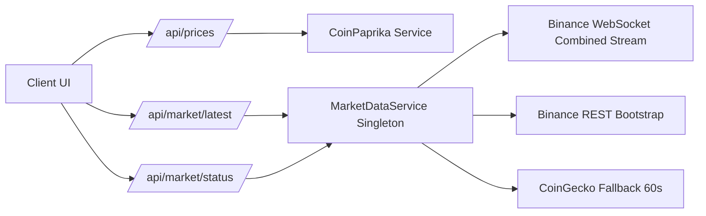

# Crypto Live Market (NestJS + Real-Time Engine)

<p align="center">
  داشبورد فارسی/RTL برای بازار کریپتو + موتور قیمت لحظه‌ای با Binance WebSocket و fallback خودکار CoinGecko
</p>

<p align="center">
  
  
  
  
</p>

---

## چرا این پروژه؟

این پروژه برای سناریوهای واقعی مانیتورینگ قیمت کریپتو طراحی شده است:
- UI فارسی و راست‌چین با چیدمان حرفه‌ای لیستی (الهام‌گرفته از نمایش‌های Market Board)
- دریافت داده‌ی بازار عمومی از CoinPaprika برای نمایش لیست کامل کوین‌ها
- موتور قیمت لحظه‌ای اختصاصی برای نمادهای کلیدی با **Binance WS**
- fallback هوشمند روی **CoinGecko** برای مواقعی که Binance از برخی IPها در دسترس نیست
- یک سرویس Singleton قابل استفاده برای چندین consumer بدون باز شدن چند اتصال WS

---

## ویژگی‌های کلیدی

- Real-time price feed با WebSocket ترکیبی Binance (بدون API Key)
- Auto-Reconnect با backoff: `1s -> 2s -> 5s -> 10s -> 30s`
- Ping/Pong handling برای پایداری اتصال
- In-memory cache برای آخرین قیمت هر symbol
- انتشار آپدیت‌ها با هر دو روش:
  - `Observable` (`updates$`)
  - `EventEmitter` (`price.update`)
- Fallback خودکار به CoinGecko با polling هر `60s` + cache
- Endpoint وضعیت برای مانیتورینگ اتصال، reconnect count و آخرین زمان آپدیت
- تست ساده parser پیام WS و parser fallback

---

## استک فنی

- **Backend:** NestJS + TypeScript
- **Realtime:** `ws`
- **Reactive stream:** `rxjs`
- **Frontend:** HTML/CSS/JS (RTL, Persian UI)

---

## معماری (خلاصه)



---

## شروع سریع

### 1) نصب

```bash
npm install
```

### 2) اجرای توسعه

```bash
npm run start:dev
```

### 3) اجرای نسخه build

```bash
npm run build
npm start
```

اپ پیش‌فرض روی `http://localhost:3000` اجرا می‌شود.

---

## اسکریپت‌ها

- `npm run start:dev` اجرای توسعه با auto-reload
- `npm run build` ساخت خروجی TypeScript در `dist`
- `npm start` اجرای build
- `npm test` build + اجرای تست‌ها (`node:test`)

---

## API Reference

### Market Board (CoinPaprika)

#### `GET /api/prices`
لیست کوین‌های برتر (پیش‌فرض 24 مورد) برای جدول اصلی UI.

---

### Real-Time Engine (Binance + Fallback)

#### `GET /api/market/latest`
آخرین قیمت cache‌شده برای symbolهای پیکربندی‌شده.

نمونه پاسخ:

```json
[
  {
    "symbol": "btcusdt",
    "price": 64617,
    "updatedAt": "2026-02-23T19:20:57.943Z",
    "source": "coingecko_fallback"
  }
]
```

#### `GET /api/market/latest/:symbol`
آخرین قیمت یک symbol خاص. (مثال: `/api/market/latest/btcusdt`)

#### `GET /api/market/latest?symbols=btcusdt,ethusdt`
فیلتر چند symbol با query string.

#### `GET /api/market/status`
وضعیت موتور real-time:
- `connected`
- `fallbackActive`
- `reconnectCount`
- `reconnectAttempt`
- `trackedSymbols`
- `lastPriceUpdateAt`

---

## ماژول قیمت لحظه‌ای

### فایل‌های مهم

- `src/market-data/market-data.service.ts`
- `src/market-data/binance-parser.ts`
- `src/market-data/coingecko-fallback.ts`
- `src/market-data/symbol-map.ts`

### رفتار اتصال

- اتصال اصلی:
  - `wss://stream.binance.com:9443/stream?streams=<symbol>@trade/...`
- subscribe اضافی ارسال نمی‌شود (stream URL یک‌بار ساخته می‌شود)
- چون combined stream استفاده شده، عملاً پیام‌های اضافی client-to-server به حداقل می‌رسد
- reconnect خودکار با backoff افزایشی

### سیاست fallback

در خطاهای رایج Binance مثل:
- `ECONNRESET`
- `403`
- `timeout`
- `fetch failed`

سرویس به شکل خودکار به CoinGecko سوئیچ می‌کند:

`https://api.coingecko.com/api/v3/simple/price?ids=<ids>&vs_currencies=usd`

Polling fallback روی `60s` تنظیم شده تا ریسک rate-limit کاهش پیدا کند.

---

## افزودن Symbol جدید

فقط فایل زیر را ویرایش کنید:

`src/market-data/symbol-map.ts`

نمونه:

```ts
export const MARKET_SYMBOLS = [
  { binanceSymbol: 'btcusdt', coinGeckoId: 'bitcoin' },
  { binanceSymbol: 'ethusdt', coinGeckoId: 'ethereum' },
  { binanceSymbol: 'bnbusdt', coinGeckoId: 'binancecoin' },
  { binanceSymbol: 'xrpusdt', coinGeckoId: 'ripple' }
];
```

نکته مهم:
- `binanceSymbol` باید lowercase باشد.
- `coinGeckoId` باید معادل دقیق CoinGecko باشد.

---

## استفاده برنامه‌نویسی (Service API)

`MarketDataService` در Nest به‌صورت Singleton ثبت شده و برای چند consumer مشترک است.

متدهای اصلی:
- `getLatestPrice(symbol)`
- `getLatestPrices(symbols?)`
- `updates$` (Observable)
- `eventEmitter` با event `price.update`

---

## تست‌ها

فایل تست‌ها:
- `test/binance-parser.test.js`
- `test/coingecko-fallback.test.js`

موارد پوشش‌داده‌شده:
- parse صحیح پیام trade در combined stream
- نادیده گرفتن eventهای نامعتبر
- ساخت صحیح URL fallback
- parse صحیح پاسخ CoinGecko

اجرا:

```bash
npm test
```

---

## لاگ و مانیتورینگ

لاگ‌های runtime برای رویدادهای کلیدی ثبت می‌شوند:
- connect / disconnect
- reconnect schedule
- fallback activation
- fallback update success/failure

برای health check سریع:

```bash
curl http://localhost:3000/api/market/status
```

---

## انتشار عمومی (GitHub Ready)

برای پابلیک‌کردن ریپو پیشنهاد می‌شود:
- فایل `LICENSE` (MIT) اضافه شود
- یک screenshot یا GIF از UI در README قرار بگیرد
- Topics مناسب روی GitHub ست شود: `nestjs`, `crypto`, `websocket`, `rtl`, `persian-ui`

---

## License

MIT (پیشنهادی)
