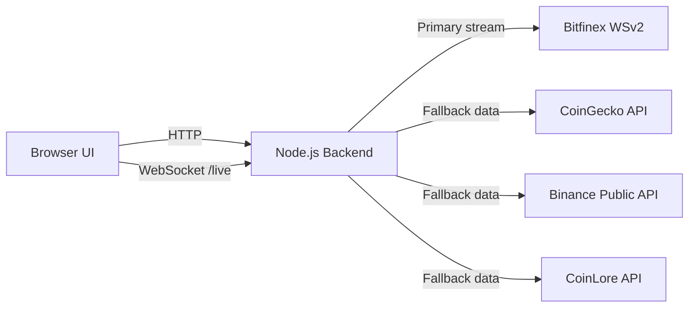

# CMC-Style Crypto Market Dashboard

A production-ready, full-stack crypto market dashboard inspired by the **layout and data presentation style of CoinMarketCap**.

This project provides:
- A responsive market table (rank, name, price, 24h change, market cap, 24h volume, mini trend)
- Real-time symbol tracking through WebSocket
- A backend with resilient multi-provider fallback when exchange APIs are geo-blocked or rate-limited
- A clean, public-facing architecture suitable for portfolio/demo deployment

## Highlights

- CMC-like market list UX and table structure
- Real-time ticker updates for selected symbols
- Smart symbol normalization (`BTC`, `BTCUSD`, `ETH/USD`, `tSOLUSD`)
- API health visibility with provider status
- Fallback chain for reliability without VPN:
  - Bitfinex WebSocket (primary)
  - CoinGecko (fallback #1)
  - Binance (fallback #2)
  - CoinLore (fallback #3)

## Architecture



## Tech Stack

- **Frontend:** Vanilla JavaScript, semantic HTML, responsive CSS
- **Backend:** Node.js + native HTTP server + `ws`
- **Market Stream:** `bitfinex-api-node` (WSv2)
- **Quality:** StandardJS linting

## Quick Start

### 1) Prerequisites

- Node.js `>= 18`
- npm

### 2) Install

```bash
npm install
```

### 3) Run

```bash
npm run start
```

Open:

```text
http://localhost:3000
```

## Environment Variables

| Variable | Default | Description |
|---|---:|---|
| `PORT` | `3000` | HTTP/WebSocket server port |
| `SYMBOL` | `tBTCUSD` | Initial tracked symbol |
| `FALLBACK_POLL_MS` | `8000` | Poll interval for fallback providers when Bitfinex is unavailable |

## API Reference

### `GET /api/health`
Returns service and provider status.

Example response:

```json
{
  "ok": true,
  "provider": "coingecko",
  "fallbackProvider": "coingecko",
  "symbols": ["tBTCUSD"],
  "wsConnected": false,
  "hasTicker": true,
  "fallbackError": null,
  "lastError": "Unexpected server response: 403"
}
```

### `GET /api/prices?q=<query>&limit=<n>`
Returns searchable market list rows used by the table.

Fields include:
- `symbol`
- `base`
- `name`
- `price`
- `change24h`
- `marketCap`
- `volume24h`

## WebSocket Protocol (`/live`)

### Client -> Server

```json
{ "type": "set-symbol", "symbol": "ETH/USD" }
```

### Server -> Client

`status` message:

```json
{
  "type": "status",
  "data": {
    "connectedToBitfinex": false,
    "provider": "coinlore",
    "symbol": "tETHUSD",
    "error": null
  }
}
```

`ticker` message:

```json
{
  "type": "ticker",
  "data": {
    "symbol": "tETHUSD",
    "lastPrice": 1864.25,
    "dailyChangePerc": -0.0395,
    "volume": 19951623685.17,
    "at": 1771872000000
  }
}
```

## Project Structure

```text
.
├── backend/
│   └── server.js          # HTTP + WebSocket gateway, stream/fallback orchestration
├── front/
│   ├── index.html         # CMC-style layout shell
│   ├── styles.css         # responsive table-driven UI
│   └── app.js             # rendering, search, symbol tracking, WS wiring
├── lib/                   # core Bitfinex transport logic
├── examples/              # Bitfinex API usage examples
└── README.md
```

## NPM Scripts

- `npm run start` -> start backend + frontend
- `npm run lint` -> run StandardJS
- `npm test` -> lint + unit/integration tests from base library

## Why This Design

The repository is optimized for **public demo reliability**:
- If direct exchange stream access is blocked, users still see searchable prices.
- The UI keeps the familiar market-table mental model used by top crypto data products.
- Real-time symbol focus and market overview coexist in a single page.

## Deployment Notes

- Deploy behind HTTPS in production (WebSocket auto-upgrades to `wss` in browser).
- If you hit provider rate limits, increase `FALLBACK_POLL_MS`.
- For enterprise use, replace free fallback APIs with paid provider keys.

## Roadmap

- Real historical sparkline data per row (instead of generated mini trend)
- Sorting and pagination controls
- Favorites/watchlist persistence
- Multi-fiat quote support (USD/EUR/TRY)

## Disclaimer

This project is for educational/demo purposes and is **not financial advice**.
Always verify market data through your preferred official sources before trading.

## License

MIT
